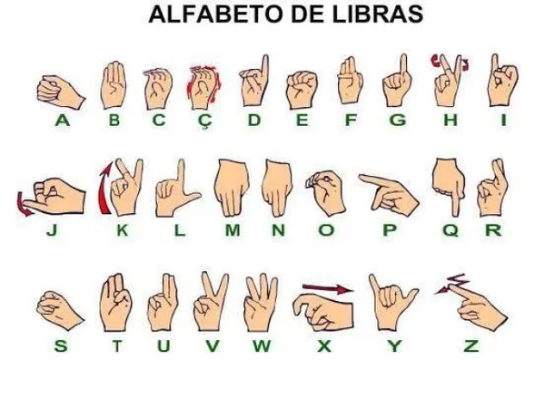
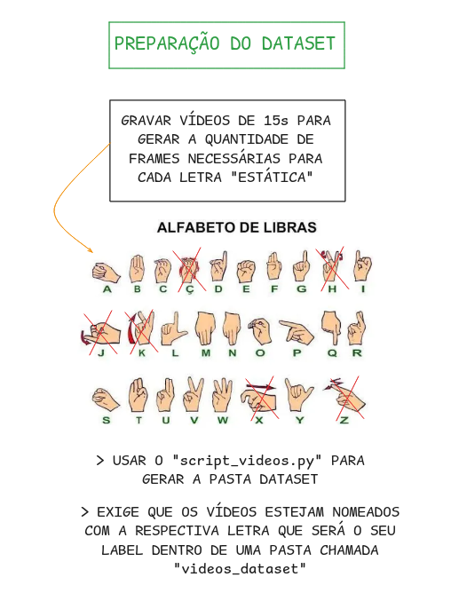
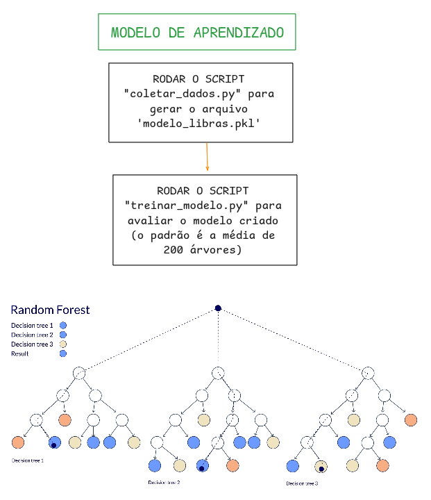
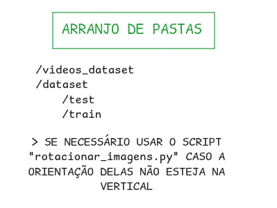
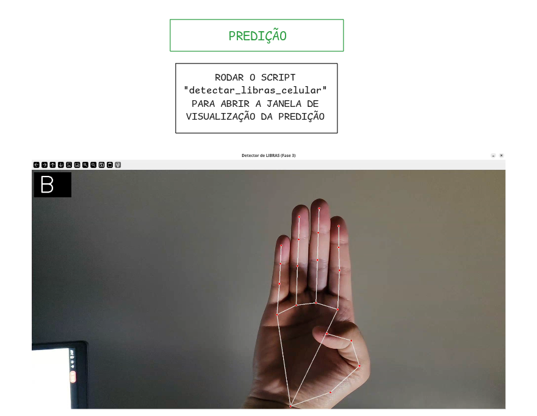

# Projeto de Identificação do Alfabeto em LIBRAS

Este é um projeto desenvolvido inicialmente para a matéria de Extensão na Faculdade de Engenharia Elétrica (FEELT/UFU). Através de aprendizado de máquina e visão computacional, o sistema identifica letras estáticas do alfabeto em LIBRAS (Língua Brasileira de Sinais). O objetivo central foi construir um pipeline capaz de capturar imagens de gestos em tempo real, extrair características anatômicas das mãos e classificar corretamente as letras do alfabeto manual.


> ⚠️ **OBSERVAÇÃO:** Letras que exigem movimento (como **Ç, H, J, K**) possuem dinâmicas que não são captadas por este algoritmo, que foca no processamento de poses estáticas em frames de vídeo.

<div align="center">
    
</div>

---

## 📱 Funcionamento e Arquitetura

O projeto baseia-se em uma arquitetura distribuída simples:

* **Celular:** Responsável por capturar o vídeo em tempo real (streaming) via app *IP Webcam*.
* **Notebook:** Unidade de processamento que recebe o vídeo, processa os frames e executa a predição.
* **Rede Local (Wi-Fi):** Meio de comunicação entre os dispositivos.

**Requisitos para conexão:**
1. Ambos os dispositivos devem estar na **mesma rede Wi-Fi**.
2. O celular deve fornecer um endereço IP acessível (ex: `192.168.x.x`).
3. A porta de streaming (padrão `8080`) deve estar aberta.
4. Firewalls no notebook não devem bloquear a conexão de entrada.

---

## 🛠️ Tecnologias Utilizadas

### MediaPipe
Detecta até **21 pontos de referência (landmarks)** tridimensionais da mão. Esses 63 valores numéricos ($21 \text{ pontos} \times 3 \text{ coordenadas } x, y, z$) formam o vetor de entrada do classificador. A vantagem é a invariância a iluminação e cor de pele, operando sobre a geometria da mão.

### Scikit-learn (Random Forest)
Utilizou-se o algoritmo **Random Forest** treinado sobre os vetores de landmarks. A escolha justifica-se pela eficiência em datasets menores e menor tendência ao *overfitting* comparado a redes neurais profundas em cenários de dados limitados. O modelo é serializado via `joblib`.

### OpenCV
Responsável pela captura de frames, pré-processamento de imagens e renderização da interface gráfica, sobrepondo os pontos detectados e o resultado da predição no vídeo.

### IP Webcam
Utilizado para transformar o smartphone em uma câmera IP, transmitindo o feed via HTTP em formato MJPEG, superando limitações de hardware (falta de webcam dedicada ou mobilidade).

---

## 🔄 Etapas do Pipeline

<div align="center">
  
  <br>
  
  <br>
  
  <br>
  
</div>

---

## 🚀 Como Reproduzir o Projeto

### 1. Clonar o Repositório
Abra o terminal e execute:
```bash
git clone https://github.com/me15degrees/libras-tradutor.git
cd libras-tradutor
```

### 2. Configurar o Ambiente
Recomenda-se o uso de um ambiente virtual:
```bash
python -m venv venv
# No Windows:
venv\Scripts\activate
# No Linux/Mac:
source venv/bin/activate
```
### 3. Instalar Dependências
```bash
pip install opencv-python mediapipe pandas scikit-learn joblib numpy
```
### 4. Executar a Predição
- Inicie o servidor no app IP Webcam no seu Android.

- Anote o IP exibido (ex: http://192.168.0.10:8080/video).

- No arquivo fase3_webcam.py (ou equivalente), altere a variável URL_CELULAR com o seu IP.

Execute o script:
```bash
python fase3_webcam.py
```